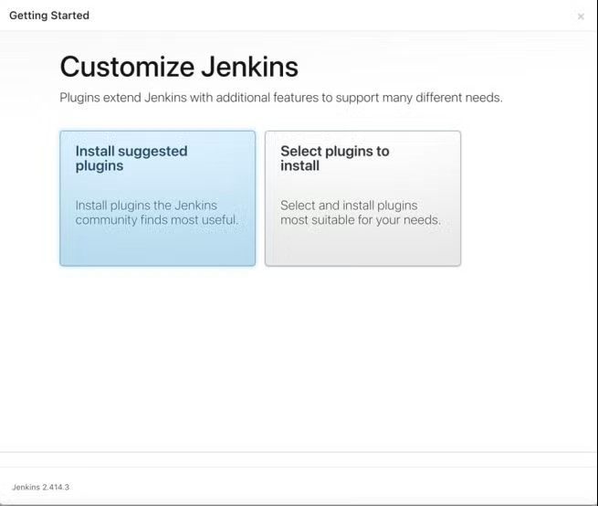

## Pre-requisites AWS setup
- Ec2 instances t2.medium
- Network SSH, TCP 
## link for Jenkins setup
https://pkg.jenkins.io/debian/

# OR
```
sudo wget -O /usr/share/keyrings/jenkins-keyring.asc \
https://pkg.jenkins.io/debian/jenkins.io-2023.key
echo "deb [signed-by=/usr/share/keyrings/jenkins-keyring.asc]" \
https://pkg.jenkins.io/debian binary/ | sudo tee \
/etc/apt/sources.list.d/jenkins.list > /dev/null
sudo apt-get update
sudo apt-get install fontconfig openjdk-17-jre # Java installation
sudo apt-get install jenkins
sudo apt-get jenkins --version
sudo apt-get status jenkins
```

## Run this cli to check jenkins pass code
```
/var/lib/jenkins/secrets/initialAdminpassword
```

## Check instead to get Jenkins passcode with host port


# OR

## Jenkins login in web
1. Open web browser
2. In url path type > hostip:8080 ( ex:125.65.85.04:8080 )

## Copy the passcode in empty given path


## Select Install suggested plugins


## Wait to load all default plugins


## Setup a first demo login password


## Successfully logined to jenkins

